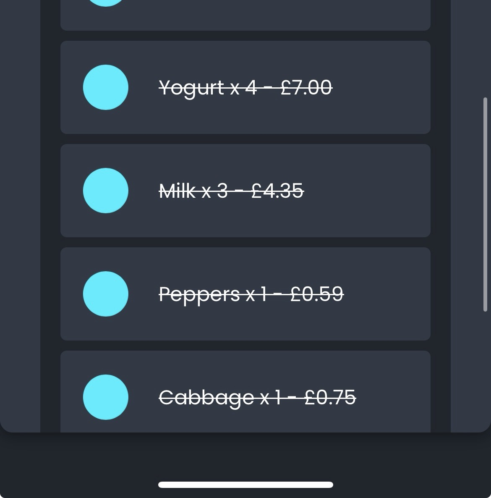

# 🛒 List N Go

**List N Go** is a smart shopping list web app that helps you **plan your groceries and budget accurately** before you shop.  
It scrapes **real-time price data** from selected stores, giving users an up-to-date total cost for their list — all within a clean and minimal interface.

> ⚠️ **Note:** The live demo is currently unavailable as the backend hosting subscription has ended.  
> The project was previously deployed on **Google Cloud Run (Free Tier)** and can be reactivated anytime.

---

## Screenshots

---

## 🧠 Overview
Unlike traditional shopping list apps, **List N Go** doesn’t rely on static or manually entered prices.  
When a user searches for an item, the app:
1. Scrapes **live prices** from the selected store(s),
2. Stores that data on the server for future users, and
3. Displays a **dynamic budget estimate** that updates as the list changes.

This allows users to plan their shopping trips with accurate, real-time cost estimates — saving both time and money.

---

## ✨ Key Features
- ⚡ **Real-Time Price Scraping** — Fetch live prices directly from store websites  
- 💾 **Server Caching** — Saves previously scraped prices to speed up future searches  
- 💰 **Instant Budget Calculation** — Updates your total as you add or remove items  
- 🧩 **Dynamic Page Layout** — The entire page scrolls naturally (no fixed list container)  
- ☁️ **Cloud Deployment** — Hosted on Google Cloud Run (Free Tier)  
- 🧘 **Minimal & Responsive Design** — Clean, distraction-free interface  

---

## 🧰 Tech Stack
| Category | Tools / Frameworks |
|-----------|--------------------|
| Frontend | HTML, CSS, JavaScript |
| Backend | Node.js / Express |
| Web Scraping | Cheerio / Axios |
| Hosting | Google Cloud Run (Free Tier) |
| Data | Cached store price data |

---

## 🚀 How It Works
1. User searches for an item (e.g. “milk”).  
2. Backend scrapes the real-time price from selected store websites.  
3. The price is cached on the server.  
4. The app calculates and displays a running total.  
5. Cached results serve future users instantly, reducing load time and server requests.  

---

## 📊 Example Use Case
- User searches “eggs” → app scrapes and stores the price.  
- Adds “bread” → total updates instantly.  
- Gets a **live budget estimate** before shopping.  
- Next user searching “eggs” gets cached data instantly.  

---
